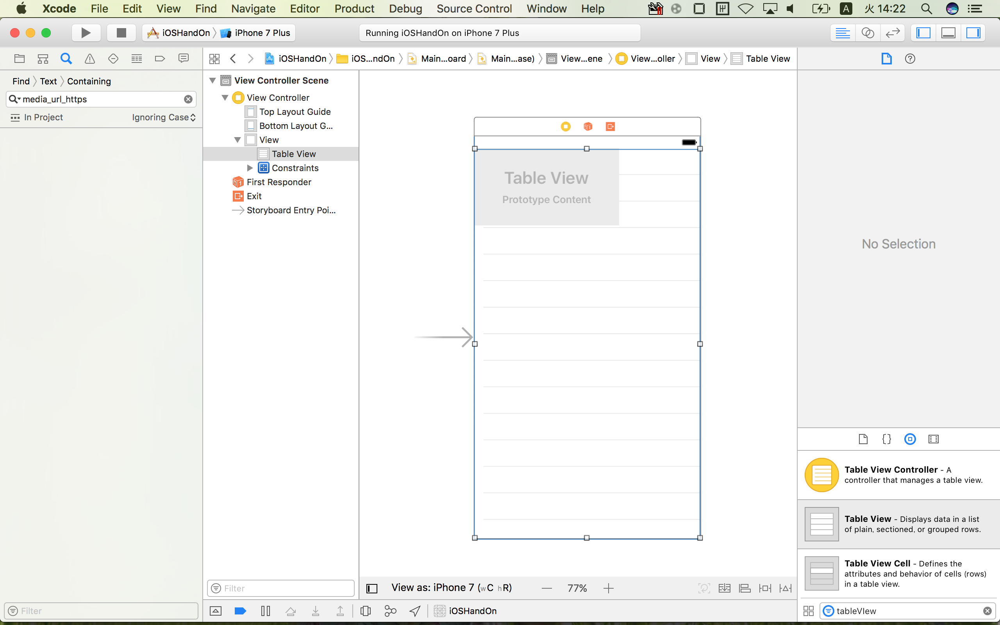

# 作業手順  
  
### 1. 本リポジトリをCloneする  
  
ターミナルから以下のコマンドを実行  
  
```  
git clone https://github.com/xxminamixx/iOSHandsOn.git  
```  
  
### 2. Xcodeでプロジェクトファイルを開く  
  
Cloneしたフォルダの*iOSHandOn.xcodeproj*  がXcodeで開くことのできるファイルとなっている  
  
### 3. ViewControllerにTableViewを配置する  
  
***ViewController***はiOSの画面と機能を結びつける役割を持つ。  
***TableView***は携帯端末のような小さな画面でも大量のデータを表示できるようにするためのスクロール機能を持ったビュー。  セルと呼ばれる帯状のビュースタックして、大量のデータをスクロール表示する。  
  
Main.storyboardを開きInterfaceBuilderからUITableViewをViewControllerにドラッグ&ドロップ



ここで一旦ビルドしてTableViewが表示されていることを確認します。

### ViewControllerにTableViewを紐づける

コードでTableViewを操作できるようにする。
***ViewController.swift***を開いた状態で***alt***を押しながら***Main.storyboard***をクリック

2画面で2ファイルが見れるようになるので、TableViewを***cntrol***を押しながら***ViewController.swift***にドラッグ&ドロップ


### NavigationControllerの配置
一旦ビルドをして動作することを確認。

### カスタムセルの作成
.swift, .xibの作成とIBOutletの接続,背景色の変更  
後ほど記述する  

### TableViewにカスタムセルの登録
nibの登録

### TableViewにカスタムセルを表示
delegateの実装  
セルの再利用  
  
### TODO入力画面の呼び出しボタンを作る  
nabigationBarのボタンアイテム追加  
Selectorの利用  
  
### TODOのテキスト入力画面を作成  
pushでの画面遷移
textViewの利用

### TODOデータを管理するDataSourceクラスの作成
TODO格納用のEntityを作成する
入力画面での追加処理を追記

###　Entityを参照してCellのラベルを変化させる

### TODOリストの数を参照してCセルの表示個数を動的に変化させる

### セルの削除処理を実装


