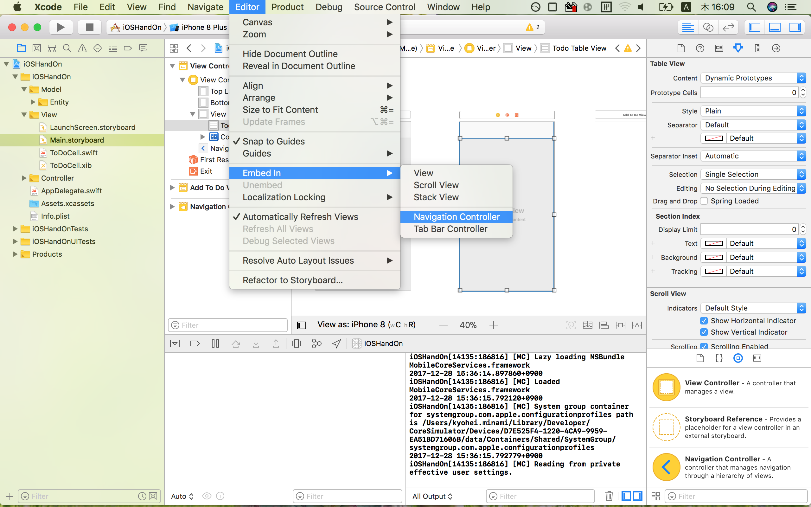
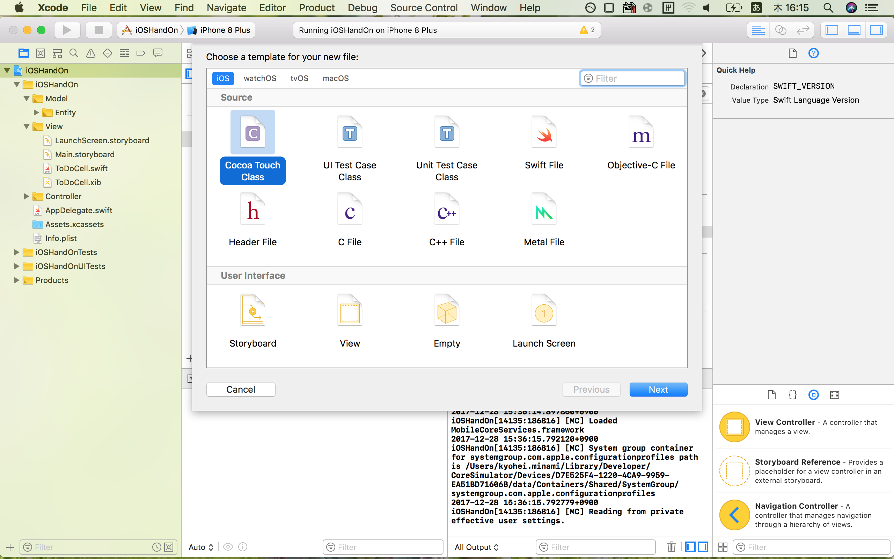
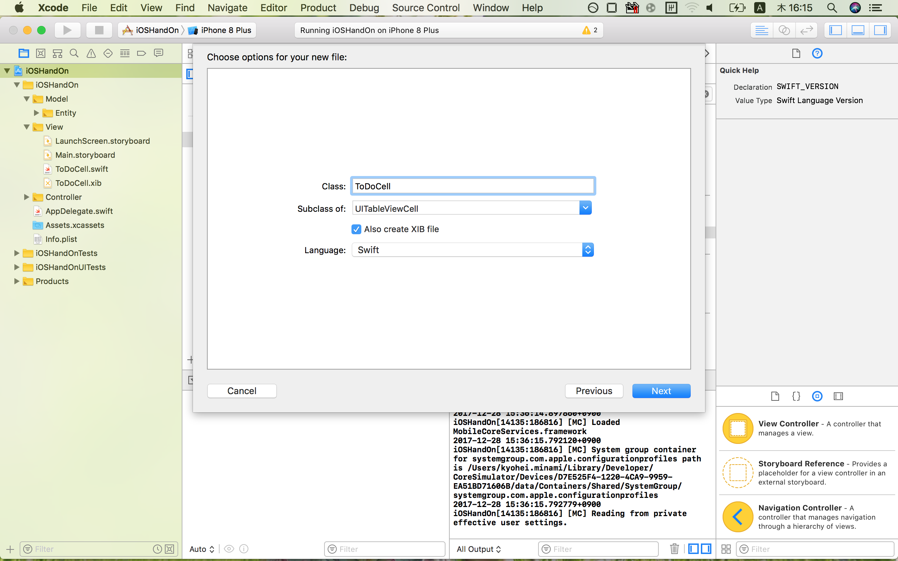

# 作業手順  

## 前準備
  
### 1. 本リポジトリをCloneする  
  
ターミナルから以下のコマンドを実行  
  
```  
git clone https://github.com/xxminamixx/iOSHandsOn.git  
```  
  
### 2. Xcodeでプロジェクトファイルを開く  
  
Cloneしたフォルダの*iOSHandOn.xcodeproj*  がXcodeで開くことのできるファイルとなっている  

## 本作業  
  
### 1. ViewControllerにTableViewを配置する  
  
***ViewController***はiOSの画面と機能を結びつける役割を持つ。  
***TableView***は携帯端末のような小さな画面でも大量のデータを表示できるようにするためのスクロール機能を持ったビュー。  セルと呼ばれる帯状のビュースタックして、大量のデータをスクロール表示する。  
  
Main.storyboardを開きInterfaceBuilderからUITableViewをViewControllerにドラッグ&ドロップ


ここで一旦ビルドしてTableViewが表示されていることを確認します。

### ViewControllerにTableViewを紐づける

コードでTableViewを操作できるようにする。
***ViewController.swift***を開いた状態で***alt***を押しながら***Main.storyboard***をクリック

2画面で2ファイルが見れるようになるので、TableViewを***cntrol***を押しながら***ViewController.swift***にドラッグ&ドロップ


### NavigationControllerの配置

ViewControllerを選択した状態で、***Editor > Embed In > NavigationController を選択する***  
  
  

### TODO入力画面の呼び出しボタンを作る  
nabigationBarのボタンアイテム追加  
Selectorの利用  

TODO追加機能の発火用にボタンを追加  

```
let rightNavigationItem = UIBarButtonItem(barButtonSystemItem: .add, target: self, action: #selector(ViewController.addButtonTapped))
navigationItem.setRightBarButton(rightNavigationItem, animated: true)
```　
    
プラスボタンタップイベント  
```
@objc func addButtonTapped() {
    guard let addToDoViewController = storyboard?.instantiateViewController(withIdentifier: "AddToDoViewController") else {
        return
    }
    navigationController?.pushViewController(addToDoViewController, animated: true)
}
```


### TODOのテキスト入力画面を作成  
pushでの画面遷移
textViewの利用  

### カスタムセルの作成  
  
iOSHandsOnプロジェクトを選択し、***Cmd + N***で新規ファイルの作成をする。  
  
  
  
  
.swift, .xibの作成とIBOutletの接続,背景色の変更  
後ほど記述する  
  
### TableViewにカスタムセルの登録  
nibの登録

```
todoTableView.register(UINib(nibName: "ToDoCell", bundle: nil), forCellReuseIdentifier: "ToDoCell")
```　


### TableViewにカスタムセルを表示

delegateの設定

```
todoTableView.delegate = self
```　

delegateの実装  
セルの再利用 

```
extension ViewController: UITableViewDelegate {
    
    // MARK: UITableViewDelegate
    func tableView(_ tableView: UITableView, numberOfRowsInSection section: Int) -> Int {
        return ToDoListEntity.shared.todoCount()
    }
    
    func tableView(_ tableView: UITableView, cellForRowAt indexPath: IndexPath) -> UITableViewCell {
        // 事前に登録しておいたセルの読み込み
        let cell = todoTableView.dequeueReusableCell(withIdentifier: "ToDoCell", for: indexPath) as! ToDoCell
        cell.todo.text = ToDoListEntity.shared.todoPick(row: indexPath.row)
        return cell
    }
    
}

```　

### TODOデータを管理するDataSourceクラスの作成
TODO格納用のEntityを作成する
入力画面での追加処理を追記

###　Entityを参照してCellのラベルを変化させる

### TODOリストの数を参照してCセルの表示個数を動的に変化させる

### セルの削除処理を実装

```
func tableView(_ tableView: UITableView, canEditRowAt indexPath: IndexPath) -> Bool {
        return true
    }
    
    func tableView(_ tableView: UITableView, commit editingStyle: UITableViewCellEditingStyle, forRowAt indexPath: IndexPath) {
        if editingStyle == .delete {
            ToDoListEntity.shared.deleteTodo(row: indexPath.row)
            tableView.deleteRows(at: [indexPath as IndexPath], with: .automatic)
        }
    }
```　


